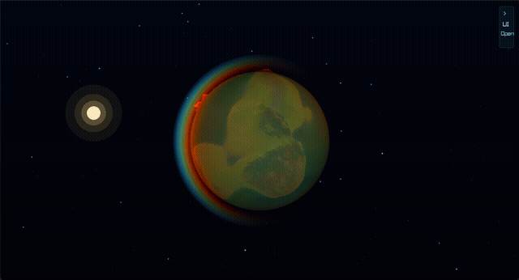
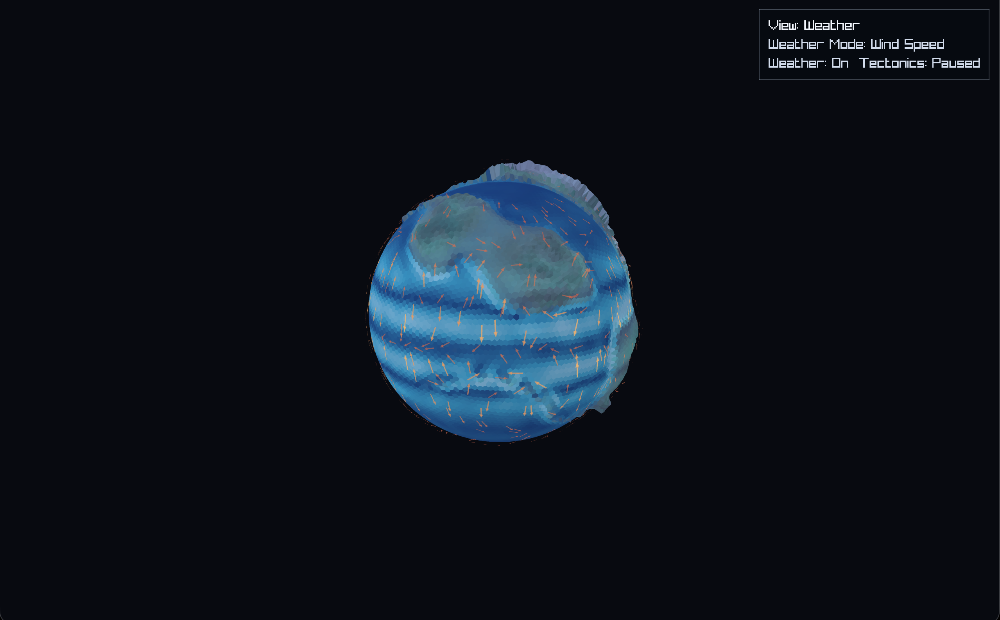
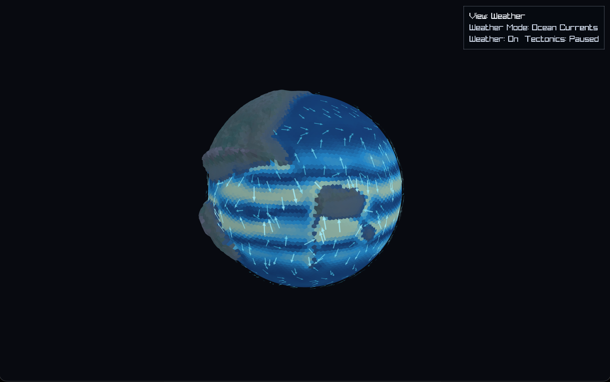
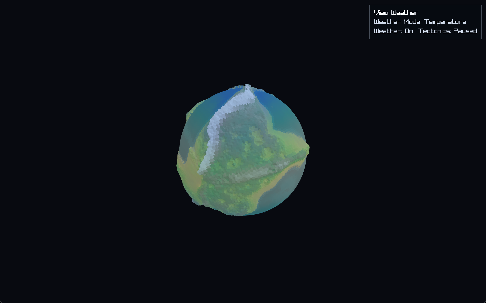
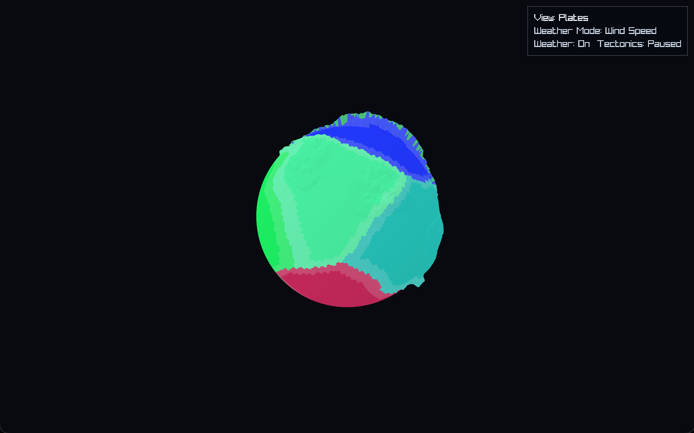

# PlanetSim

A real-time procedural planet simulator written in C using [raylib](https://www.raylib.com/). Simulates tectonic plates, terrain generation, and a dynamic weather system — all running live on a 3D globe.

Weather is physically motivated: trade winds and westerlies drive atmospheric circulation, mountain ranges cast rain shadows, valleys channel wind, coastal regions stay humid, and the ITCZ brings equatorial rainfall. Ocean gyres and currents respond to wind stress and Coriolis forces.



---

## Features

- **Tectonic simulation** — plates drift, collide, and build mountain ranges over time
- **Atmospheric circulation** — trade winds, westerlies, polar highs, ITCZ, and storm tracks
- **Terrain-driven weather** — orographic lift, rain shadows, valley channeling, cold pooling
- **Ocean currents** — gyre patterns, wind-driven drift, Coriolis deflection
- **11 visualization modes** — temperature, pressure, wind, humidity, clouds, rain, snow, vorticity, and more

---

## Screenshots

| Wind | Ocean Currents |
|---|---|
|  |  |

| Temperature | Tectonic Plates |
|---|---|
|  |  |

---

## Building

Requires [raylib](https://www.raylib.com/) installed.

```sh
make
./planet
```

---

## Controls

- **Left drag** — rotate globe
- **Scroll** — zoom
- **Keys** — switch visualization modes
