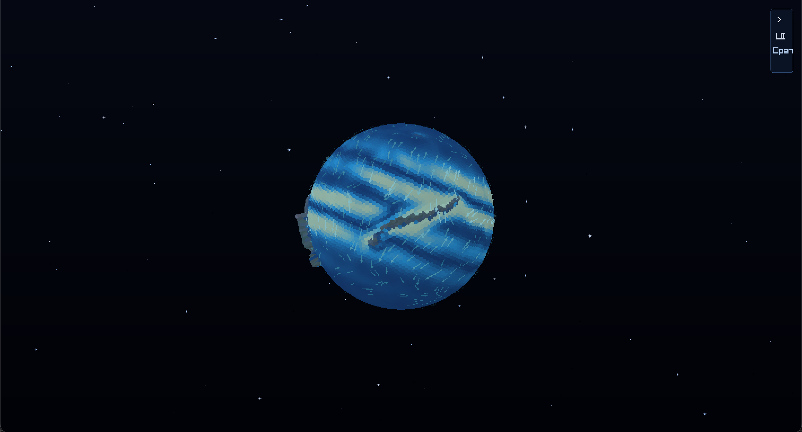
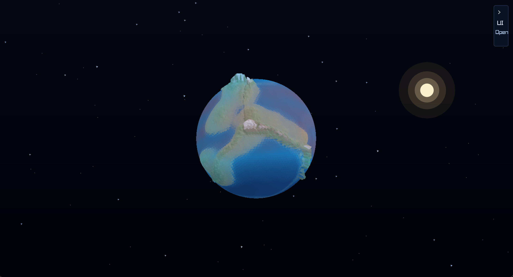
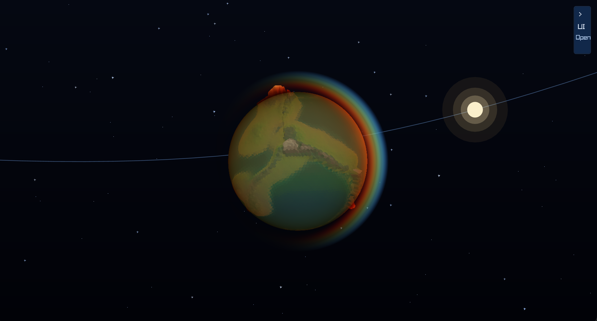
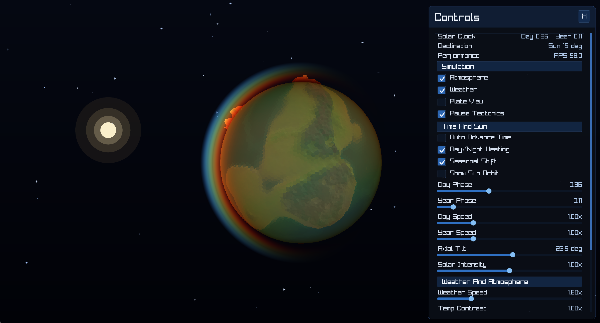

# PlanetSim

A real-time procedural planet simulator written in C using [raylib](https://www.raylib.com/). Simulates tectonic plates, terrain generation, and a dynamic weather system — all running live on a 3D globe.

Weather is physically motivated: trade winds and westerlies drive atmospheric circulation, mountain ranges cast rain shadows, valleys channel wind, coastal regions stay humid, and the ITCZ brings equatorial rainfall. Temperature, pressure, humidity, clouds, and runoff respond to terrain height, slope, coast exposure, solar forcing, fronts, and ocean heat inertia. A tile-edge transport layer exchanges heat, vapor, cloud water, pressure, wind momentum, ocean heat, and soil water across the spherical mesh.


---

## Features

- **Tectonic simulation** — plates drift, collide, and build mountain ranges over time
- **Atmospheric circulation** — trade winds, westerlies, polar highs, ITCZ, and storm tracks
- **Mesh weather transport** — finite-volume-style edge fluxes move heat, pressure, water vapor, cloud water, wind, ocean heat, and soil moisture
- **Terrain-driven weather** — orographic lift, rain shadows, valley channeling, cold pooling
- **Altitude-aware climate** — lapse-rate cooling, pressure falloff, coastal moderation, and terrain exposure
- **Ocean currents** — gyre patterns, wind-driven drift, Coriolis deflection
- **Sun-driven climate** — day/night heating, axial tilt, seasons, and ocean heat transport
- **Tilt-axis guide** — visual north/south axis marker for understanding axial tilt and seasons
- **Pop-out climate charts** — draggable and resizable summary and per-layer yearly cycle charts for every weather visualization mode
- **Persistent ice cover** — freezing seas and glaciers remain visible across terrain and weather views
- **Biome classification** — temperature × moisture based biome map with neighbor blending
- **Ocean temperature simulation** — thermal inertia, current advection, coastal upwelling
- **Live control panel** — adjust weather speed, solar forcing, atmosphere tuning, and view modes in real time
- **Sun orbit guide** — visualize the sun's seasonal path around the planet
- **13 visualization modes** — temperature, pressure, wind, currents, humidity, clouds, rain, snow, vorticity, storm, evaporation, ocean temperature, biomes

---

## Screenshots

### Ocean Currents


### Precipitation


### Atmosphere with Sun Orbit Guide


### Control Panel


---

## Building

Requires [raylib](https://www.raylib.com/) installed.

```sh
make
./planet
```

---

## Controls

- **Left drag** — rotate globe
- **Scroll** — zoom
- **F1** — show or hide the control panel
- **A / C / W / T / P / Space** — atmosphere, plate view, weather, tilt-axis guide, pause time, tectonics pause
- **Tab / 1-0 / E / R / B** — cycle or jump to weather visualization modes
